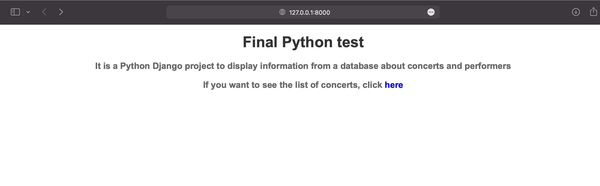
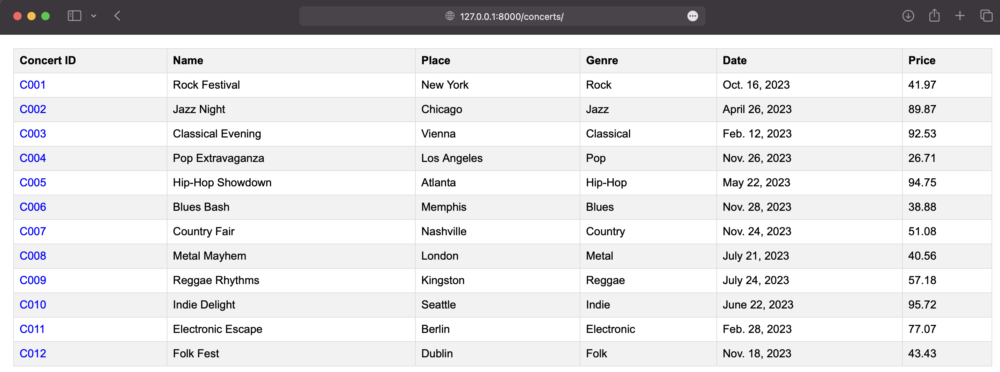
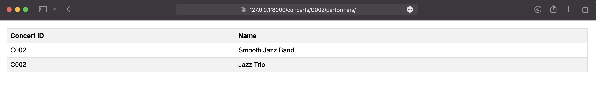
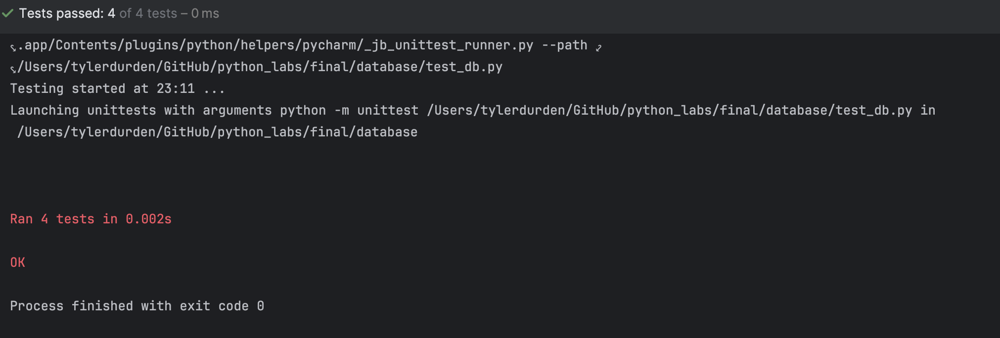

```
pip install django
sudo apt install python3-django
django-admin startproject concerts
cd concerts
```
```
python manage.py makemigrations
python manage.py collectstatic
python manage.py runserver
```





